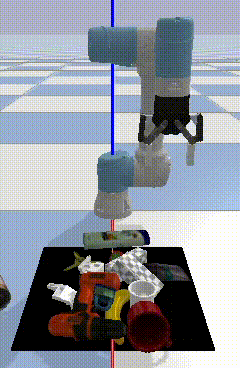
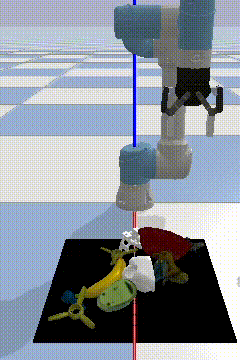
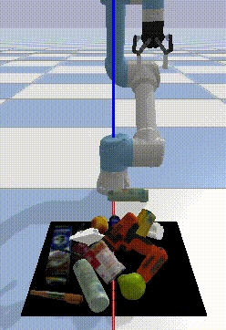
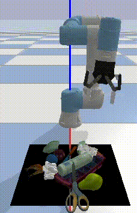

# A Joint Modeling of Vision-Language-Action for Target-oriented Grasping in Clutter
This is the official repository for the paper: A Joint Modeling of **Vi**sion-**L**anguage-Action for Target-oriented **G**rasping in Clutter (ICRA 2023).

[Paper](https://arxiv.org/abs/2302.12610) | [Video](https://www.bilibili.com/video/BV1yh4y1a7Ha/?spm_id_from=333.999.0.0)


We focus on the task of language-conditioned grasping in clutter, in which a robot is supposed to grasp the target object based on a language instruction. Previous works separately conduct visual grounding to localize the target object, and generate a grasp for that object. However, these works require object labels or visual attributes for grounding, which calls for handcrafted rules in planner and restricts the range of language instructions. In this paper, we propose to jointly model vision, language and action with object-centric representation. Our method is applicable under more flexible language instructions, and not limited by visual grounding error. Besides, by utilizing the powerful priors from the pre-trained multi-modal model and grasp model, sample efficiency is effectively improved and the sim2real problem is relived without additional data for transfer. A series of experiments carried out in simulation and real world indicate that our method can achieve better task success rate by less times of motion under more flexible language instructions. Moreover, our method is capable of generalizing better to scenarios with unseen objects and language instructions.


#### Contact

Any question, please let me know: kcxu@zju.edu.cn

## Setup
###  Installation

- Ubuntu 18.04
- Torch 1.7.1, Torchvision 0.8.2
- Pybullet (simulation environment)
- Cuda 11.1
- GTX 3060, 12GB memory is tested

```
git clone git@github.com:xukechun/Vision-Language-Grasping.git
cd Vision-Language-Grasping

conda create -n vilg python=3.8
conda activate vilg

pip install -r requirements.txt

python setup.py develop

cd models/graspnet/pointnet2
python setup.py install

cd ../knn
python setup.py install
```

###  Potential Issues of installation
- When installing graspnetAPI, the following problem might occur:
```
× python setup.py egg_info did not run successfully.
│ exit code: 1
╰─> [18 lines of output]
The 'sklearn' PyPI package is deprecated, use 'scikit-learn'
rather than 'sklearn' for pip commands.
```
solution:
```
export SKLEARN_ALLOW_DEPRECATED_SKLEARN_PACKAGE_INSTALL=True
```
- Check the version of compatible torch and torchvision of your machine (especially the cuda vision) if the following problem occurs:
```
RuntimeError: CUDA error: no kernel image is available for execution on the device
```
solution: to install torch with the right cuda version, e.g.
```
# CUDA 11.0
pip install torch==1.7.1+cu110 torchvision==0.8.2+cu110 -f https://download.pytorch.org/whl/torch_stable.html
```

### Assets
We provide the processed object models in this [link](https://drive.google.com/drive/folders/1WxKDFXJktoqiP0jmkDZrMCcNNBx5u-YM?usp=drive_link). Please download the file and unzip it in the `assets` folder.

### Pretrained Model
We provide the pretrained model in this [link](https://drive.google.com/drive/folders/1LCuoXX92X8L9wqJTbVqvskjRhTJrDDay?usp=sharing). 


## Training

```
python train.py
```

## Evaluation
To test the pre-trained model, simply change the location of `--model_path`:

```python
python test.py --load_model True --model_path 'PATH OF YOUR CHECKPOINT FILE'
```

## Demos
<div align="left">

|  |  |
|:--:|:--:|
|"give me the cup"|"I need a fruit"|
|   |  |
|"get something to drink"|"grasp a round object"|


## Citation

If you find this work useful, please consider citing:

```
@INPROCEEDINGS{10161041,
  author={Xu, Kechun and Zhao, Shuqi and Zhou, Zhongxiang and Li, Zizhang and Pi, Huaijin and Zhu, Yifeng and Wang, Yue and Xiong, Rong},
  booktitle={2023 IEEE International Conference on Robotics and Automation (ICRA)}, 
  title={A Joint Modeling of Vision-Language-Action for Target-oriented Grasping in Clutter}, 
  year={2023},
  pages={11597-11604},
  doi={10.1109/ICRA48891.2023.10161041}}
```

